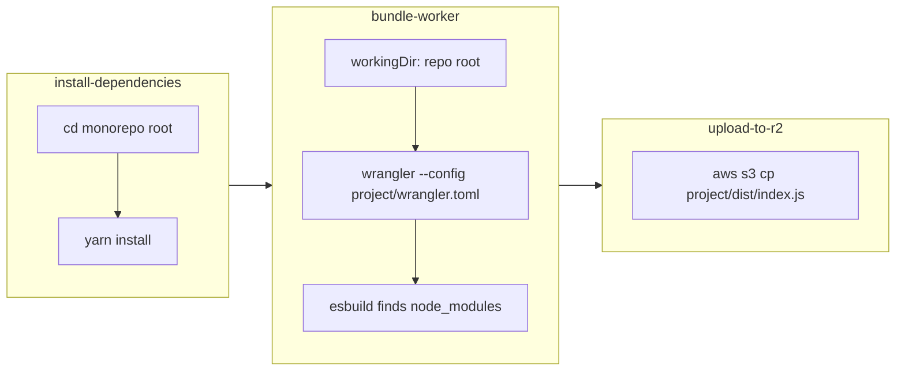

# Fix Wrangler Build for Yarn Workspaces

**Date**: December 30, 2025
**Type**: Bug Fix
**Components**: Pipeline, Build System

## Summary

Fixed the Cloudflare Worker pipeline's `bundle-worker` and `upload-to-r2` tasks to run from the repository root instead of the project subdirectory. This enables wrangler/esbuild to correctly resolve yarn workspace dependencies like `@planton/protos` and `@bufbuild/protobuf`.

## Problem Statement

After migrating to yarn workspaces for shared TypeScript protobuf stubs, Cloudflare Worker builds failed during the wrangler bundling step with module resolution errors.

### Pain Points

- `Could not resolve "@planton/protos/..."` - Workspace packages not found
- `Could not resolve "@bufbuild/protobuf"` - Transitive dependencies not found
- Build completed in `install-dependencies` step but failed in `bundle-worker`
- Error not immediately obvious - appeared to be a bundler configuration issue

### Root Cause

When using yarn workspaces:
1. `yarn install` runs at the monorepo root (via `package-manager-directory: "."`)
2. Dependencies are hoisted to the root's `node_modules/`
3. Workspace packages like `@planton/protos` are symlinked in root `node_modules/`
4. The `bundle-worker` step was running wrangler from the project subdirectory
5. esbuild couldn't find `node_modules/` because it only existed at the parent monorepo root

## Solution

Updated both `bundle-worker` and `upload-to-r2` tasks to run from the repository root with project-root-relative paths.

### Key Changes

**bundle-worker step**:
```yaml
# Before
workingDir: /workspace/source/$(params.project-root)
script: |
  npx wrangler deploy --dry-run --outdir=dist

# After
workingDir: /workspace/source
script: |
  PROJECT_ROOT="$(params.project-root)"
  npx wrangler deploy --dry-run \
    --config "$PROJECT_ROOT/wrangler.toml" \
    --outdir "$PROJECT_ROOT/dist"
```

**upload-to-r2 step**:
```yaml
# Before
workingDir: /workspace/source/$(params.project-root)
script: |
  aws s3 cp dist/index.js s3://...

# After
workingDir: /workspace/source
script: |
  PROJECT_ROOT="$(params.project-root)"
  aws s3 cp "$PROJECT_ROOT/dist/index.js" s3://...
```

### Why --config Works

Wrangler's `--config` flag specifies which `wrangler.toml` to use. Importantly, paths defined in `wrangler.toml` (like `main = "src/index.ts"`) are resolved relative to the config file's location, not the current working directory. This means:

- wrangler runs from repo root → esbuild finds `node_modules/`
- `--config` points to the worker's `wrangler.toml` → correct entry point resolved
- `--outdir` places bundle in the correct project subdirectory

## Implementation Details

### Files Changed

| File | Change |
|------|--------|
| `pipelines/cloudflare-worker.yaml` | Updated `bundle-worker` and `upload-to-r2` workingDir and scripts |
| `pipelines/cloudflare-worker.md` | Updated documentation with new behavior and Mermaid diagram |

### Workflow Diagram



## Benefits

### For Monorepo Users
- Workspace dependencies (`workspace:*` protocol) now resolve correctly
- No changes required to individual worker projects
- Works with sparse checkout for efficient cloning

### For Standalone Workers
- Backward compatible - default behavior unchanged
- wrangler resolves paths relative to config file regardless of working directory

## Impact

### Who's Affected
- Any Cloudflare Worker using yarn/npm/pnpm workspaces with `workspace:*` dependencies
- Planton Cloud's internal workers: `auth0-webhooks-receiver`, `stripe-webhooks-receiver`, `git-webhooks-receiver`

### Testing
- Pipeline changes tested with monorepo workspace configuration
- Verified module resolution for `@planton/protos` and `@bufbuild/protobuf`

## Related Work

- `2025-12-29-130103-add-monorepo-workspace-support-to-cloudflare-worker-pipeline.md` - Added `package-manager-directory` parameter
- Planton Cloud: `2025-12-29-123827-centralize-typescript-stubs-with-yarn-workspaces.md` - Yarn workspaces migration that exposed this issue

---

**Status**: ✅ Production Ready
**Timeline**: ~30 minutes implementation

